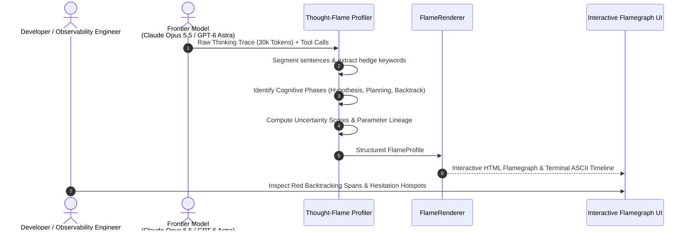
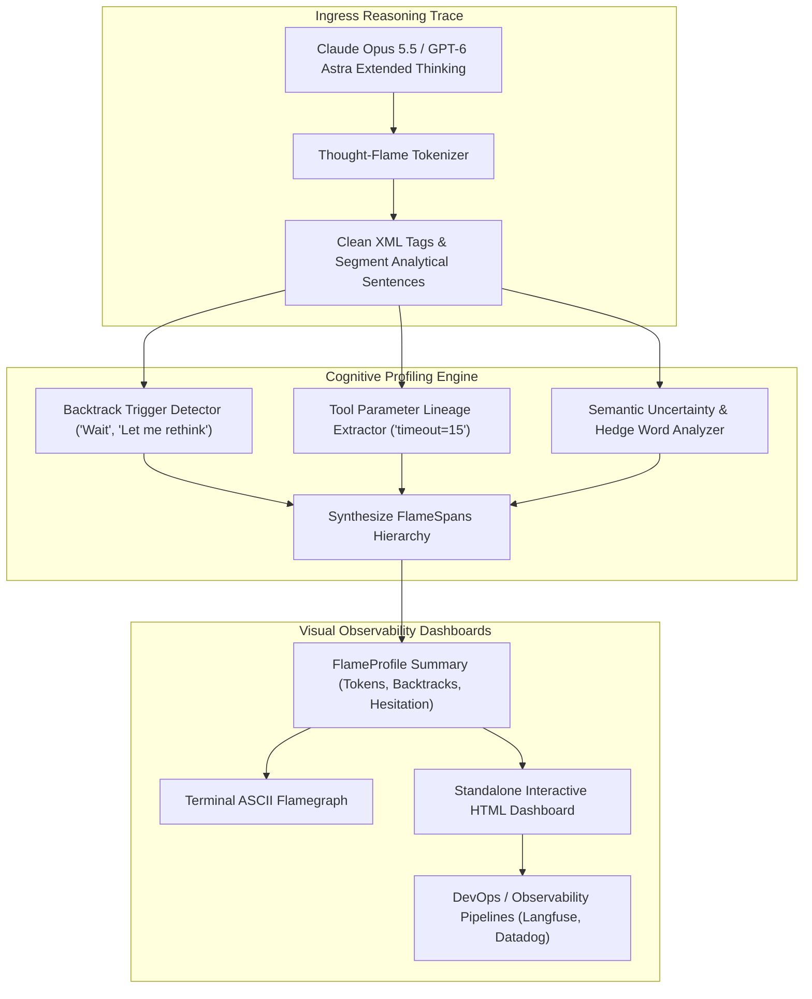
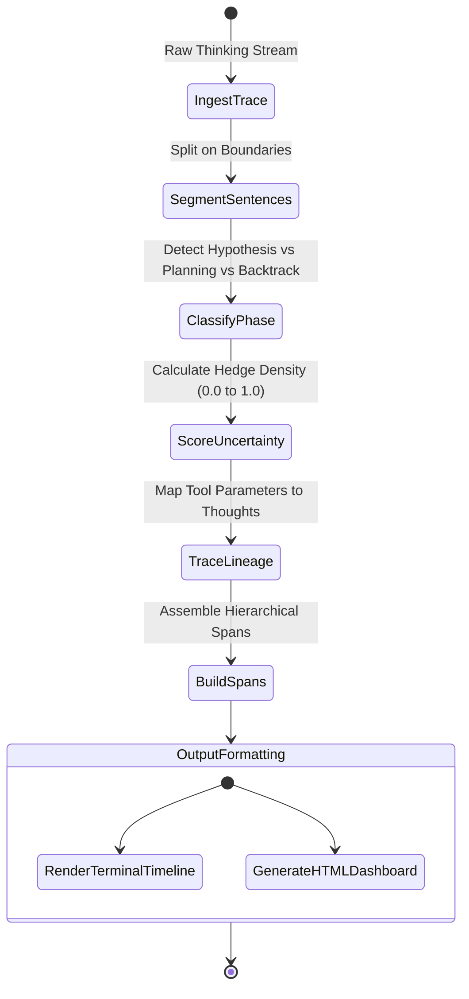

# 🔥 Thought-Flame

> **Visual Flamegraph & Cognitive Uncertainty Profiler for Agent Extended Thinking Traces**  
> Transforms 30,000-word unstructured reasoning traces from frontier models (**Claude Opus 5.5**, **GPT-6 Astra**, **Gemini 3.8 Flash**) into interactive visual flamegraphs. Detects dead-end backtracking, visualizes hesitation hotspots, and establishes direct causal links between thinking tokens and outbound tool parameters.

[](https://opensource.org/licenses/MIT)
[](https://www.python.org/downloads/)
[](https://github.com/AAH20/thought-flame)
[](https://anthropic.com)

---

## ⚡ The Problem: The Unreadable Reasoning Trace

Frontier models (**Claude Opus 5.5**, **GPT-6 Astra**) output massive extended thinking sequences (`<thinking>...</thinking>`) before triggering tool actions. When an agent enters an infinite loop, hallucinates a parameter, or fails a test:
1. **The 60-Page Text Dump**: Developers must scroll through 40,000 words of dense prose trying to pinpoint where the model's logic went off the rails.
2. **Invisible Hesitation & Hallucination Points**: Unstable assumptions and high-uncertainty guesses are buried in boilerplate reasoning.
3. **Unclear Parameter Lineage**: Why did the agent pass `timeout=15` or `order_id="tx_99"`? Finding the specific thought that justified a tool parameter is like looking for a needle in a haystack.

**Thought-Flame** profiles unstructured thinking traces in `<1ms`, segmenting them into cognitive phases (`HYPOTHESIS`, `PLANNING`, `BACKTRACKING`, `TOOL_DETERMINATION`), flagging discarded dead-ends, and rendering interactive HTML/SVG flamegraphs with hesitation hotspots.

---

## 🏛️ Architecture & Profiling Flow







---

## 🚀 Key Features

- **Instant Profiling (<1ms)**: Parses and scores 30,000 tokens of reasoning in less than 1 millisecond.
- **Dead-End Backtracking Detection**: Flags every moment the model hesitated, reconsidered, or discarded a flawed implementation hypothesis.
- **Uncertainty & Hesitation Hotspots**: Scores semantic entropy based on hedging markers, highlighting where the model is guessing vs confident.
- **Causal Tool Parameter Lineage**: Automatically identifies the exact sentence in the thought stream that caused the agent to select a specific tool parameter.
- **Multi-Format Export**: Generates clean terminal ASCII timelines and self-contained interactive HTML dashboards.

---

## 📦 Quick Start

### Installation

```bash
pip install thought-flame
```

### Python SDK Usage

```python
from thought_flame import TraceProfiler, FlameRenderer

raw_thinking = """
<thinking>
First, examine table locks in PostgreSQL schema.
Maybe unindexed foreign keys cause slow checkouts.
Wait, let me rethink that: query logs show exclusive table locks!
The plan is to add optimistic locking.
I will call tool bash with timeout=15.
</thinking>
"""

# Profile reasoning trace
profile = TraceProfiler.profile_trace(raw_thinking)

print(f"Total Tokens: {profile.total_tokens}")
print(f"Backtracking Count: {profile.backtrack_count}")

# Print ASCII timeline
print(FlameRenderer.render_ascii_flame(profile))

# Generate HTML Dashboard
html = FlameRenderer.render_html_dashboard(profile)
```

---

## 💻 CLI Interactive Demonstration

Run the built-in interactive demo to observe real-time trace profiling, backtracking detection, and ASCII flamegraph rendering:

```bash
thought-flame demo
```

```
==========================================================================
  THOUGHT-FLAME: Cognitive Flamegraph Profiler for AI Reasoning
  Visualizing Uncertainty & Backtracking in Claude Opus 5.5 & GPT-6 Astra
==========================================================================

[STEP 1] PROFILING RAW EXTENDED THINKING TRACE
  Total Estimated Tokens : 198
  Backtracking Points    : 3 (Dead-End Paths Pruned)
  Average Uncertainty    : 0.14 (Hesitation Index)
  Profiling Duration     : 0.627 ms

[STEP 2] TOOL PARAMETER CAUSAL LINEAGE
  * Parameter `timeout` derived from: "I will call tool bash with command to inspect lock queries, passing timeout=15 seconds."

[STEP 3] TERMINAL COGNITIVE FLAME TIMELINE:
--------------------------------------------------------------------------
=== THOUGHT-FLAME COGNITIVE PROFILE ===
Total Tokens: 198 | Backtracks: 3 | Avg Uncertainty: 0.14

span_001 [PLANNING  ] ██████                                 (Uncertainty: 0.00) : Step 1: Inspect the reported database transaction deadlock o...
span_002 [PLANNING  ] ██████                                 (Uncertainty: 0.00) : First, we need to examine table row locking order in the Pos...
span_003 [HYPOTHESIS] ███████                                (Uncertainty: 0.35) : Maybe the problem is caused by unindexed foreign key lookups...
span_004 [BACKTRACKI] ▓▓▓▓▓▓▓▓                   [BACKTRACK] (Uncertainty: 0.00) : Wait, let me rethink that: the query logs indicate an exclus...
span_005 [BACKTRACKI] ▓▓▓▓▓▓                     [BACKTRACK] (Uncertainty: 0.00) : This would fail if concurrent webhooks attempt migrations du...
span_006 [PLANNING  ] █████                                  (Uncertainty: 0.00) : The plan is to check the connection pool settings in databas...
span_007 [HYPOTHESIS] ██████                                 (Uncertainty: 1.00) : Perhaps we might assume an aggressive lock timeout will clea...
span_008 [BACKTRACKI] ▓▓▓▓▓▓▓                    [BACKTRACK] (Uncertainty: 0.00) : Actually, holding on: an aggressive timeout would cause casc...
span_009 [HYPOTHESIS] ██████                                 (Uncertainty: 0.00) : Instead, we should add optimistic concurrency control with r...
span_010 [TOOL_DETER] ███████                                (Uncertainty: 0.00) : I will call tool bash with command to inspect lock queries, ...
--------------------------------------------------------------------------

[STEP 4] INTERACTIVE HTML FLAMEGRAPH GENERATED (6887 bytes)
  Saved in-memory visual flamegraph. Ready for observability dashboard export.

==========================================================================
  THOUGHT-FLAME PROFILING COMPLETE: 100% REASONING TRANSPARENCY
==========================================================================
```

---

## 🧪 Testing

Run the full unit test suite:

```bash
python3 -m unittest discover -s tests -p "test_*.py" -v
```

---

## 📄 License

MIT License. Designed and maintained for cognitive observability in 2026.
